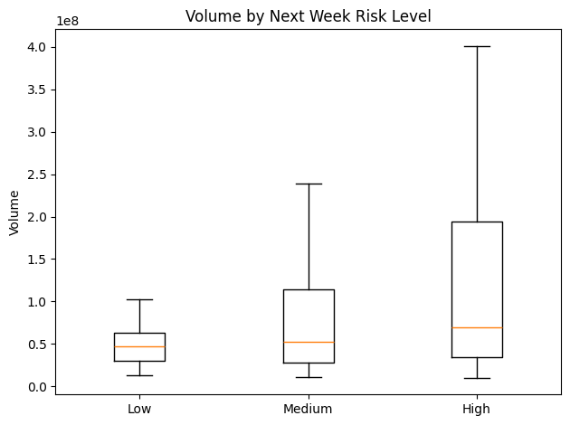
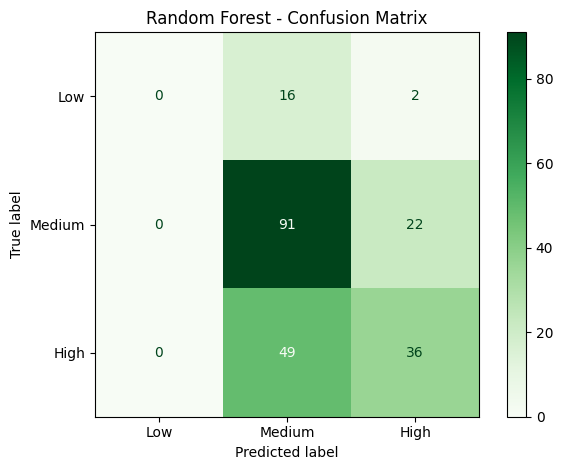

# Progress Report
## 1. Header
**Name**: Hyungkyu Lee  
**Title:** Next-Week Risk Classification of Dow Jones Stocks Using Machine Learning  
**Date:** Sat Dec 6, 2025  
https://github.com/epicTommy/Data-Driven-Problem-Solving-ML-Project/blob/main/Progress%20Report.md

 **Wrote Original Report on Markdown so visiting GitHub Repo or looking at the .md file is recommended**

## 2. Dataset Selection
I am using the Dow Jones Index Weekly Stock Dataset, originally released by Brown, Pelosi, and Dirska (2013). The dataset contains 750 weekly records of Dow Jones Industrial Average (DJIA) component stocks, with 16 attributes describing price movement, volume, dividend details, and next-week performance.

### Source & Citation 
Brown, M. (2013). Dow Jones Index [Dataset]. UCI Machine Learning Repository. https://doi.org/10.24432/C5788V.

### Dataset Size
* 750 stock-week records
* 16 features per record
* No missing values  

✅ Meets the dataset size requirement for the project.

### Brief Description
* Weekly open, high, low, close prices
* Volume and percent change metrics
* Dividend timing and return
* Next week’s price

➡️ This dataset enables both classification and forecasting tasks related to stock behavior.

## 3. Problem Statement
The goal of this project is to predict the risk level of a Dow Jones stock for the upcoming week, based on its performance data from the current week  

### Classification Problem: 
Predict whether a stock will fall into Low Risk, Medium Risk, or High Risk based on the expected price volatility for next week.

### Why This Problem Matters
Short-term investors must predict returns and manage risk. This model will help people make more informed stock-buying decisions.

### Target Classes
Classes are formed by categorizing next week volatility (percentage range between high and low relative to open price).

* Low Risk — Volatility < 2%

* Medium Risk — 2% ≤ Volatility ≤ 4%

* High Risk — Volatility > 4%


**Equation:**  

Let:

$$ V_{next} = \frac{High - Low}{Open} \times 100 $$

Then the risk categories are defined as:

$$
\text{Risk}(V_{\text{next}}) =
\begin{cases}
\text{Low Risk} & 0 \le V_{\text{next}} < 4 \\
\text{High Risk} & V_{\text{next}} \ge 4
\end{cases}
$$


## 4. Progress Summary (1–2 pages)
### Completed Work:
#### EDA findings

The distribution is very imbalanced.





#### Preliminary results & Initial Model Implemented
```
====== Random Forest Classification Summary =======
              precision    recall  f1-score   support

        High       0.60      0.42      0.50        85
         Low       0.00      0.00      0.00        18
      Medium       0.58      0.81      0.68       113

    accuracy                           0.59       216
   macro avg       0.39      0.41      0.39       216
weighted avg       0.54      0.59      0.55       216
```


### Code Snippets
#### Data loading & Changing Type
```python 
df = pd.read_csv("/content/drive/MyDrive/data_driven_final_project/dow+jones+index/dow_jones_index.data")
print('='*25, 'Data Head', '='*25)
display(df.head())
print('\n\n','='*25, 'Data Info', '='*25)
df.info()
df['date'] = pd.to_datetime(df['date'])

price_cols = [
    "open",
    "high",
    "low",
    "close",
    "next_weeks_open",
    "next_weeks_close"
]


for col in price_cols:
    df[col] = df[col].replace(r"[^0-9.-]", "", regex=True).astype(float)
    
print(df.dtypes)
```
#### Calculating Next Week's Volatility and Categorizing
```python 
# This week's volatility (% range)
df["weekly_volatility"] = (df["high"] - df["low"]) / df["open"] * 100

# Next week's volatility
df["next_week_volatility"] = df.groupby("stock")["weekly_volatility"].shift(-1)

# Drop rows where next week doesn't exist (last week per stock)
df = df.dropna(subset=["next_week_volatility"]).reset_index(drop=True)
print("\nAfter next_week_volatility, shape:", df.shape)

# Divide risks into category: next_week_risk
# Low: <2%, Medium: 2–4%, High: >4%
bins = [0, 2, 4, 100]
labels = ["Low", "Medium", "High"]

df["next_week_risk"] = pd.cut(
    df["next_week_volatility"],
    bins=bins,
    labels=labels,
    include_lowest=True
)

print("\nNext_week_risk distribution:")
print(df["next_week_risk"].value_counts())
```

#### EDA
```python 
risk_distribution = df['next_week_risk'].value_counts()

plt.figure(figsize=(8, 8))
plt.pie(risk_distribution, labels=risk_distribution.index, autopct='%1.1f%%', startangle=140, colors=['#ff9999','#66b3ff','#99ff99'])
plt.title('Distribution of Next Week Risk Categories')
plt.ylabel('') # Hide the default 'count' label
plt.show()
```
The Dataset is very unbalanced.

```python 
plt.figure()
df["next_week_volatility"].hist(bins=30)
plt.title("Distribution of Next Week Volatility")
plt.xlabel("Next Week Volatility (%)")
plt.ylabel("Count")
plt.tight_layout()
plt.show()
```

```python 
plt.figure()
order = ["Low", "Medium", "High"]
data_for_box = [df.loc[df["next_week_risk"] == r, "volume"] for r in order]
plt.boxplot(data_for_box, labels=order, showfliers=False)
plt.title("Volume by Next Week Risk Level")
plt.ylabel("Volume")
plt.tight_layout()
plt.show()
```

```python 
numeric_cols = df.select_dtypes(include=["float64", "int64"]).columns
corr = df[numeric_cols].corr()

corr = df.corr(numeric_only=True)
plt.figure(figsize=(10,8))
sns.heatmap(corr, annot=True, cmap="coolwarm", fmt=".2f", linewidths=0.5)
plt.title("Correlation Heatmap")
plt.tight_layout()
plt.show()
```

#### Random Forest

```python 
rf_clf = RandomForestClassifier(
    n_estimators=200,
    max_depth=None,
    random_state=42,
    class_weight="balanced"
)

rf_clf.fit(X_train, y_train)
y_pred_rf = rf_clf.predict(X_test)

print("\n=== Random Forest Classification Summary ===")
print(classification_report(y_test, y_pred_rf))

cm_rf = confusion_matrix(y_test, y_pred_rf, labels=labels)
disp_rf = ConfusionMatrixDisplay(confusion_matrix=cm_rf, display_labels=labels)
disp_rf.plot(cmap="Greens")
plt.title("Random Forest - Confusion Matrix")
plt.tight_layout()
plt.show()
```

## Work Plan
### What remains to be done?
1. One more model
    - Maybe Logistic Regression
2. Hyperparameter tuning
3. Model comparison tuning
4. Use resampling techniques
    - If the data is unbalanced even after adjusting the risk categories, resampling techniques will be required.
5. Presentation & Recording

#### Timeline (deadlines)
* 12-10-2025: Adjust the risk categories to reasonable ranges
* 12-13-2025: Hyperparameter tuning
* 12-17-2025: Model comparison tuning
* 12-18-2025: Presentation slides
* 12-18-2025: Presentation recording and final submission
